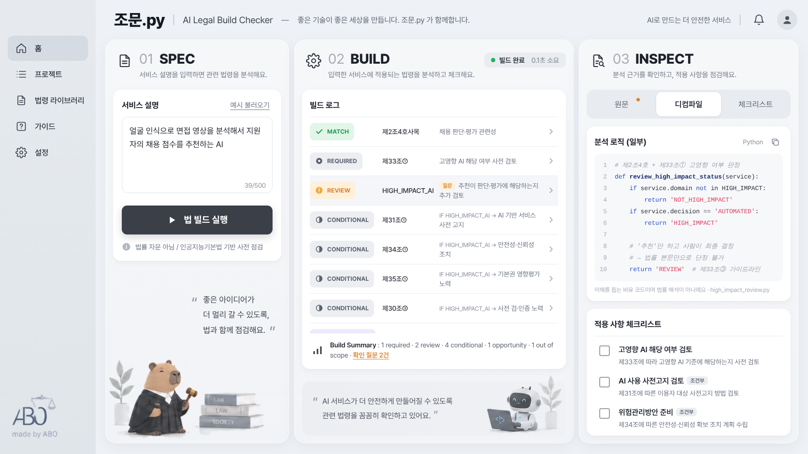

# 조문.py — AI Legal Build Checker

> **법조문을 읽는 대신, 법 빌드를 돌립니다.**
> 개발할 AI 서비스를 한 줄로 설명하면, 인공지능기본법에서 걸리는 조문을 찾아 **빌드 로그**처럼 보여주는 RAG + Rule Engine 기반 Legal Linter



- 대상 법령: 인공지능 발전과 신뢰 기반 조성 등에 관한 기본법 (법률 제20676호, 2026.1.22. 시행, 2026.1.20. 개정 반영)
- **법률 자문이 아닙니다.** 인공지능기본법 이해를 돕기 위한 사전 점검 도구입니다.

---

## 빠른 시작

Python 3.10 이상이 필요합니다.

```bash
# 1. 가상환경 만들고 켜기
python -m venv venv
venv\Scripts\activate          # Windows CMD
# source venv/bin/activate     # Mac / Linux

# 2. 패키지 설치
pip install -r requirements.txt

# 3. (선택) 환경 변수 — API 키가 없어도 동작합니다
copy .env.example .env         # Windows
# cp .env.example .env         # Mac / Linux

# 4. (선택) 법령 PDF → Chroma 적재. 하면 INSPECT 화면에 'RAG 검색 근거'가 함께 보여요
python -m scripts.ingest

# 5. 서버 실행 → 브라우저에서 http://127.0.0.1:8000
python run.py
```

API 키가 없으면 키워드 규칙 기반 추출기와 로컬 해싱 임베딩으로 동작합니다. `.env`에 `OPENAI_API_KEY`를 넣으면 서비스 특성 추출에 LLM(LangChain + OpenAI)을 씁니다.

---

## 화면 구성

| 영역 | 하는 일 |
| --- | --- |
| **01 SPEC** | 서비스 설명 입력, `예시 불러오기`(평가셋 10개 순환), `법 빌드 실행` (Ctrl+Enter) |
| **02 BUILD** | 빌드 로그 — 조문별 판정 상태 배지, Build Summary, 남은 확인 질문 수 |
| **03 INSPECT** | `원문`: 조문 원문 · 판정 근거 · 하위 규정 의존 · 제재 경로(근거 체인) · 되묻기 질문 / `디컴파일`: 조문을 코드로 번역 / `체크리스트`: 조문별 구현 항목 |
| 적용 사항 체크리스트 | 빌드 결과 전체에서 할 일 모음 (체크 상태는 브라우저에 저장) |

### 판정 상태

| 상태 | 의미 |
| --- | --- |
| `MATCH` | 서비스 특성이 조문의 정의·영역과 일치 |
| `REQUIRED` | 조건이 확정된 사업자 의무 (MUST) |
| `CONDITIONAL` | 조건이 확정되면 적용되는 의무 (예: `IF HIGH_IMPACT_AI →`) |
| `SHOULD` | 노력의무 |
| `REVIEW` | 법률 본문만으로 단정 불가 → 되묻기 질문 |
| `OPPORTUNITY` | 공공기관 도입 검토 시 우선 고려 요소, 받을 수 있는 지원 |
| `OUT OF SCOPE` | 인공지능기본법 밖의 법률 검토가 필요할 수 있음 (판정하지 않음) |
| `INFO` | 참고 |

되묻기 질문에 답하면 다시 빌드되어 `CONDITIONAL`이 `REQUIRED` / `SHOULD`로 승격됩니다.
(예: "고영향 AI로 보고 대비할게요" 선택 → 제31조①·제34조① REQUIRED, 제35조① SHOULD)

---

## 동작 방식

```
SERVICE SPEC
   ↓  ① 특성 추출 (LLM 또는 규칙) — 판정하지 않고 사실만 뽑는다
   ↓  ② Scope Check — 제4조① 역외 적용 / 제4조② 적용 제외
   ↓  ③ Chroma 검색 — 근거 표시용 (판정에는 쓰지 않음)
   ↓  ④ Rule Engine — 고영향 여부, REQUIRED / CONDITIONAL / REVIEW 판정
   ↓  ⑤ Penalty · Reference Graph — DIRECT / INDIRECT / NONE
BUILD LOG → INSPECT (원문 │ 디컴파일 │ 체크리스트)
```

핵심 설계: **LLM은 판결하지 않는다.** 특성만 추출하고, 판정은 규칙이, 근거는 원문이 맡는다.

| 컴포넌트 | 파일 |
| --- | --- |
| 서비스 특성 스키마 | `app/schemas.py` |
| 특성 추출 (LLM / 규칙) | `app/engine/features.py`, `app/engine/prompts.py` |
| Clause Parser (법률 문법 → MUST/SHOULD/MAY, EXTERNAL) | `app/engine/grammar.py` |
| Rule Engine | `app/engine/rules.py` |
| Penalty Graph | `app/engine/penalty.py` |
| 파이프라인 | `app/engine/pipeline.py` |
| PDF 전처리·청킹 | `app/rag/preprocess.py` |
| Chroma 적재·검색, 로컬 임베딩 | `app/rag/store.py`, `app/rag/embeddings.py` |

### 핵심 데이터: `data/tagged/articles.json`

제2·4·16③·17③·30~36·40·43조를 **절(clause) 단위**로 직접 태깅한 66개 레코드입니다. 원문은 PDF와 글자 단위로 대조했습니다. 이 JSON 하나가 Rule Engine의 근거, Chroma 메타데이터, 평가 정답지를 겸합니다.

```json
{
  "id": "ARTICLE_33_1_A",
  "ref_label": "제33조①",
  "text": "인공지능사업자는 … 사전에 검토하여야 하며,",
  "addressee": "AI_BUSINESS",
  "condition": ["PROVIDES_AI_OR_AI_SERVICE"],
  "obligation": "MUST",
  "status_rule": "REQUIRED",
  "external_dependency": null,
  "penalty": { "type": "NONE", "ref": null, "path": [] }
}
```

- `addressee`(수범자): 주어가 장관·국가기관등인 조문을 사업자의 의무로 오해하지 않게 한다.
- `obligation`과 `external_dependency`는 별개의 축: "누가 무엇을 해야 하나" vs "하위 규정이 필요한가"
- `penalty`: MUST라도 제재가 없거나(제33조①), 사실조사를 거치는 간접 제재(제34조①)일 수 있다.

디컴파일 코드는 `data/tagged/decompiled/*.py`에 있습니다. 이해를 돕는 비유이며 법률 해석이 아닙니다.

---

## 평가 — Naive RAG vs RAG + Rule Engine

```bash
python -m scripts.ingest      # 먼저 적재
python -m scripts.evaluate    # 결과 → data/eval/results.json
```

평가셋 `data/eval/cases.json` 10개 (얼굴 인식 채용의 바목 함정, 경찰 얼굴 인식 대조군, 생성형 표시 의무, 영화 추천 오탐 방지, 해외 기업, 국방 전용, 외부 LLM API 등).

로컬 해싱 임베딩 기준 실행 결과:

| 지표 | Naive RAG | RAG + Rule |
| --- | --- | --- |
| 고영향 영역(목) 판정 정확도 | 0.7 | 1.0 |
| 정답 조문 Hit | 0.5 (top-3) | 1.0 |
| 조문별 판정 상태 정확도 | — | 1.0 |

> Naive의 영역 정확도 0.7에는 '고영향 영역 아님'이 정답인 케이스에서 아무 목도 못 찾은 경우가 포함돼 있습니다. 로컬 임베딩은 글자 n-gram 기반이라 의미 검색이 약합니다. `EMBEDDING_PROVIDER=openai`로 바꾸면 Naive 수치가 달라지므로, 발표에서는 두 임베딩 결과를 함께 보여주는 것을 권장합니다.

---

## 테스트

```bash
python -m pytest -q
```

문법 파서(SHOULD > MUST 우선순위, 어미 변화, 한 문장 두 절), 판정 엔진(데모 케이스, 답변 후 승격, 국내대리인 흐름, 제32조 자동 제외 금지), 제재 경로, 평가셋 10개 정답 일치를 확인합니다.

> 참고: `한다`의 첫 글자는 `하`가 아니라 `한`이라서, 어간을 `하여야\s*하`로만 잡으면 가장 흔한 형태인 "하여야 한다"를 놓칩니다. `grammar.py`는 `(한|하)`로 둘 다 잡습니다.

---

## API

| 메서드 | 경로 | 설명 |
| --- | --- | --- |
| `POST` | `/api/build` | `{"spec": "...", "answers": {"high_impact": "assume"}}` → 빌드 결과 |
| `GET` | `/api/examples` | 평가셋 예시 목록 |
| `GET` | `/api/articles` | 태깅된 조문 목록 |
| `GET` | `/api/articles/{id}` | 조문 레코드 하나 |
| `GET` | `/api/health` | 추출기·벡터DB 상태 |

`answers` 키: `high_impact`(automated / human_final / assume), `domestic_office`(yes / no / unknown), `threshold`(yes / no / unknown), `compute`(yes / no / unknown)

Swagger 문서: http://127.0.0.1:8000/docs

---

## 폴더 구조

```
jomun-py/
├── run.py                    # 서버 실행
├── requirements.txt
├── .env.example
├── app/
│   ├── main.py               # FastAPI (화면 + API)
│   ├── config.py             # 설정 모음
│   ├── schemas.py            # ServiceFeatures, BuildRequest
│   ├── engine/               # 특성 추출 · 문법 파서 · Rule Engine · Penalty Graph
│   ├── rag/                  # PDF 전처리 · 임베딩 · Chroma
│   └── static/               # index.html, css, js, img, fonts
├── data/
│   ├── raw/                  # 법령 PDF
│   ├── tagged/               # articles.json (핵심), decompiled/*.py
│   └── eval/cases.json       # 평가셋
├── scripts/                  # ingest.py, evaluate.py
└── tests/                    # pytest
```

---

## 다음 단계 (Stretch)

- [ ] 2차 빌드 `--validate`: 구현 상태 체크 → `ERROR` / `PASS`
- [ ] Plain 모드: 비개발자용 쉬운 설명 (LLM 표현 단계)
- [ ] 시행령·고시·가이드라인 문서 추가 → `EXTERNAL` 항목 해소
- [ ] 법령 라이브러리·프로젝트 화면 (사이드바 메뉴는 현재 자리만 있음)
- [ ] 리포트 Export

---

## 출처·라이선스

- 법령 원문: 국가법령정보센터. 법령은 저작권법 제7조에 따라 보호받지 않는 저작물입니다.
- 글꼴: [Pretendard](https://github.com/orioncactus/pretendard) (SIL Open Font License 1.1, `app/static/fonts/Pretendard-LICENSE.txt`)
- `app/static/img/`의 일러스트·로고: UI 시안 이미지에서 잘라낸 임시 이미지입니다. 원본 일러스트로 교체하세요.
