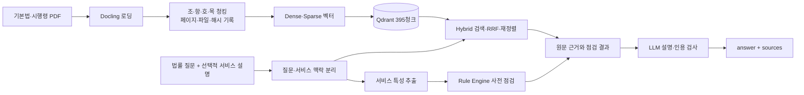

# 조문.py 발표용 기획안

2026-10-08 현재 구현 기준 · 3인 팀 발표 자료의 원고

## 1. 발표의 중심 문장

> **조문.py는 AI 기본법을 질문하면 원문 근거로 설명하고, 내 AI 서비스를 함께 설명하면 출시 전에 확인할 법적 조건을 개발자가 이해할 말로 정리한다.**

RFP의 공통 흐름인 **Docling → Qdrant → 검색 개선·재정렬 → 근거 기반 LLM 답변 → 평가**를 `/ask`에 구현한다. 기존 서비스 점검의 특성 추출·Rule Engine은 서비스 설명이 있을 때 더하는 차별점이다. LLM이 고영향 여부를 혼자 확정하는 제품으로 소개하지 않는다.

## 2. 사용자 문제와 제품의 답

AI 기본법의 조문은 개발자가 곧바로 제품 요구사항으로 읽기 어렵다. 한 조문만 찾아도 대상, 조건, 의무 강도, 시행령 위임을 다시 확인해야 한다. 일반 법률 QA는 조문 뜻을 설명할 수 있지만, “그래서 **내 서비스**에는 무엇을 확인해야 하나?”라는 다음 질문까지 이어지기 어렵다.

조문.py는 두 질문을 한 입력에서 받는다.

> “고영향 AI란 무엇인가요? 저는 면접 영상을 분석해 지원자의 채용 점수를 추천하는 AI 서비스를 준비 중인데 해당하나요?”

답변은 **① 조문의 의미 ② 이 서비스에서 확인할 사실·조건 ③ 각 문장의 원문 근거** 순으로 보여준다. 판단에 필요한 사실이 빠졌으면 확정 표현을 피하고 무엇을 확인해야 하는지 적는다. 법률 질문만 있으면 서비스별 판정은 하지 않는다.

## 3. 현재 제품 범위

| 기능 | 현재 구현과 발표 범위 |
| --- | --- |
| `POST /ask` | 일반 질문, 서비스 설명이 있는 질문, 한 입력창의 복합 질문. `answer`, `sources`, `mode` 반환 |
| QA 원문 | 인공지능기본법 제21311호와 시행령 제36580호 PDF의 Docling 청크 **395개**를 Qdrant에 적재 |
| 검색 | dense + sparse, RRF, 법률 용어 질의 확장, 규칙 기반 재정렬. sparse IDF 적용 |
| 근거 표현 | 답변의 `[S번호]`와 조문 원문·문서·페이지·원본 파일을 연결 |
| 서비스 맥락 | 서비스 설명에서 사실 특성을 추출하고 Rule Engine으로 적용 가능성을 사전 점검 |
| 기존 `/api/build` | 6종 문서 전체 1,769개 청크 중 판정 대상 1,189개를 BM25로 검색하는 별도 서비스 점검 기능. Chroma·RRF 비교도 가능 |
| 화면 | 법률 질문/서비스 점검 입력, 관련 근거와 적용 가이드, 조문 관계도 라이브러리 |

**데이터 경계:** BKL 해설은 2차 자료다. `/api/build`에서는 원문 11개와 요약 9개를 구분해 사용하지만, `/ask`의 법령 원문 근거는 기본법·시행령 두 문서로 제한한다. 법제처 API JSON은 법령 버전 대조에 쓰고 임베딩하지 않는다.

## 4. 시스템 설계



서비스 설명이 없는 질문에서는 **특성 추출·Rule Engine 경로를 사용하지 않는다.** 복합 질문에서는 법 개념 부분과 서비스 설명 부분을 분리하고, 정의 조문과 서비스 영역 근거를 모두 답변 후보에 넣는다. 화면에서 보이는 법령 관계도는 별도 태깅·원문 참조 데이터로 만든 탐색 기능이다. 관계도 자체가 검색 정확도나 법적 판정을 증명하지는 않는다.

### API 예시

```json
{
  "question": "고영향 AI란 무엇인가요? 제가 면접 영상을 분석해 채용 점수를 추천하는 AI 서비스를 준비 중인데 해당하나요?"
}
```

`service_description`을 별도로 보내도 된다. 응답의 필수 내용은 `answer`와 `sources`이고, `mode`는 `general` 또는 `service`다. 원문 근거는 답변에 인용된 출처만 반환한다. 이 문서의 입력 문장은 **시연 질문 예시**이지 특정 서비스의 법적 결론이 아니다.

## 5. RFP와 조문.py의 연결

| RFP 단계 | 조문.py가 하는 일 | 현재 검증 상태 |
| --- | --- | --- |
| Loading·Chunking | 현재 지정한 PDF를 Docling으로 읽고 법령 구조와 출처 메타데이터 보존 | 청크·원본 검증 테스트 통과 |
| Embedding·Vector DB | QA 2종은 Qdrant, 서비스 점검은 청크 1,769개를 저장하고 기본 검색은 BM25 | `/api/health`에서 QA 395개와 Chroma 1,769개 확인. BM25 검색 대상 1,189개 |
| Retrieval 개선 | Dense·sparse RRF, 다중 질의, 규칙 재정렬, IDF | QA 개발셋과 sparse 전후 실험 기록 |
| Grounded Answer | 검색 원문과 서비스 점검 결과를 LLM에 전달하고 인용 ID 검사 | API 형식·복합 질문은 대체 LLM 테스트 통과. 실제 LLM 재검수 필요 |
| Evaluation | QA 검색 Hit@K·MRR, 서비스 점검 dev/held-out, 전체 테스트 | QA용 새 held-out 및 사람의 실제 답변 검수는 남음 |

## 6. 발표에 쓸 수 있는 수치와 해석

### QA 검색 개발셋 12문항

| 비교 | Hit@3 | MRR | 말할 수 있는 결론 |
| --- | ---: | ---: | --- |
| Dense 단독 | 0.833 | 0.653 | 구어체 질문과 짧은 조문 청크에서 누락이 있었다 |
| Hybrid + 다중 질의 + 규칙 재정렬 | 1.000 | 0.917 | 이 **12개 개발 질문**에서는 상위 3개에 정답이 모두 있었다 |
| Sparse 단독, IDF 전 → 후 | 0.750 → 1.000 | 0.618 → 0.667 | 같은 12문항에서 sparse 결과가 바뀌었다 |

첫 두 행은 IDF 적용 **전** 비교이며 여러 검색 기법이 동시에 달라졌다. 세 번째 행은 IDF만 적용하고 기존 dense 벡터를 유지한 비교다. 이 숫자를 “처음 보는 질문의 정확도”나 “LLM 답변 정확도”로 발표하지 않는다. 새 dense 문맥 코드는 작성됐지만 원격 임베딩 429 때문에 실제 Qdrant 재적재와 효과 측정이 끝나지 않았다.

**BM25 표기 주의:** `/ask`의 현행 sparse는 Qdrant IDF 기반 검색이고, 정식 BM25는 비교 실험만 했다. 같은 QA 개발 질문 12개에서 현행 sparse Hit@3은 1.000, 단어 기반 BM25는 0.583, 단어+글자 bigram BM25는 0.917이었다. 따라서 온라인 QA가 BM25를 사용한다고 소개하지 않는다. [슬라이드 교체 문안](BM25_온라인질의_슬라이드_20261008.md), [실험 원자료](../bm25_compare.json)를 참고한다.

### 별도 서비스 점검 평가

6종 문서 서비스 점검 경로는 Chroma·BM25·RRF를 같은 dev 11건과 held-out v1 11건으로 비교했다. dev 후보 재현율은 Chroma **0.89**, BM25 **0.94**, RRF **0.89**라 BM25를 기본값으로 골랐다. held-out v1에서 후보 재현율은 **0.87 → 0.93**, 최종 검색→규칙 점검 정확도는 **0.61(22/36) → 0.69(25/36)**였다. 검색 누락 3건이 줄었고 특성 추출·규칙 오류 11건은 남았다. 이것은 **QA 12문항과 다른 과제의 지표**다. [방식 비교](../build_retrieval_compare.json)를 참고한다.

### 테스트

2026-10-08 Windows 가상환경에서 작업 폴더 안의 pytest 임시 경로를 지정해 `python -m pytest -q`를 다시 실행한 결과 **261 passed**. 실제 MonoRouter 생성 답변의 법률 문장까지 자동으로 맞았다는 뜻은 아니다. 복합 질문은 로컬 Qdrant와 대체 LLM으로 정의·영역 조문을 함께 인용하는지 검증했다.

## 7. 차별점 설명에 쓸 문장

- “다섯 팀이 같은 AI 기본법 QA를 만들지만, 저희는 **일반 질문에서 내 서비스 질문으로 넘어가는 흐름**을 제품의 중심에 뒀습니다.”
- “법률 원문을 쉬운 말로 바꾸되, ‘의무’, ‘조건부’, ‘노력의무’, ‘추가 검토’를 한 단어로 뭉개지 않습니다.”
- “서비스의 사실은 추출하고, 적용 가능성은 Rule Engine으로 점검하며, LLM은 근거를 붙여 설명합니다.”
- “정답 조문이 검색됐는지와 답변 문장이 정확한지는 따로 평가합니다.”

## 8. 권장 슬라이드 구성: 8~10분

| 장 | 제목 | 발표자가 보여줄 것 | 핵심 문장 |
| ---: | --- | --- | --- |
| 1 | 조문.py가 푸는 문제 | 제품 한 문장 + 복합 질문 예시 | “AI 기본법을 내 서비스의 확인 사항으로 연결합니다.” |
| 2 | RFP와 차별점 | 공통 RAG 흐름과 서비스 맥락 추가 지점 | “공통 기술 요구를 수행하고, 서비스 점검을 한 단계 더합니다.” |
| 3 | 데이터 신뢰성 | 원본 PDF, 법령번호·시행일, 청크 출처 메타데이터 | “출처를 파일과 페이지까지 되짚을 수 있습니다.” |
| 4 | 오프라인 파이프라인 | Docling → 구조 청킹 → Qdrant 395개 | “조문 구조와 원본 출처를 보존해 검색 가능한 청크로 만듭니다.” |
| 5 | 온라인 파이프라인 | `/ask`의 Qdrant dense+sparse(IDF)·RRF와 선택적 서비스 맥락의 Rule Engine 점검을 결합. `/api/build` BM25는 별도 기능으로 표기 | “법률 질문은 원문 검색, 서비스 설명은 규칙 사전 점검을 더해 답합니다.” |
| 6 | 복합 질문 시연 | 한 입력에 정의 질문과 서비스 설명 입력, 출처 보기 | “한 번 질문해도 개념과 내 서비스 근거를 분리해 답합니다.” |
| 7 | 검증 결과 | QA 개발셋 표와 서비스 점검 held-out 표를 **각각** 표시 | “좋았던 수치와 미해결 오류를 함께 봅니다.” |
| 8 | 한계와 다음 실험 | QA held-out, API 429, 새 dense 재적재·사람 검수 | “현재 수치의 범위를 분명히 하고 다음 검증을 설계했습니다.” |

관계도 화면은 시간이 남을 때 6장의 보조 장면으로 쓴다. 410개 관계를 법적 추론의 정답처럼 소개하지 않는다.

### 발표 멘트 예시

**도입(약 30초):** “이번 과제의 공통 목표는 AI 기본법 원문을 검색하고 근거를 붙여 답하는 QA입니다. 저희는 여기서 한 단계 더 나아가, 사용자가 자기 서비스를 함께 설명하면 조문의 의미와 그 서비스에서 확인할 조건을 한 답변에 담았습니다. 실제 법적 결론을 대신하기보다 개발 전에 검토할 출발점을 제시합니다.”

**결과·한계(약 30초):** “12개 개발 질문에서는 hybrid와 규칙 재정렬의 Hit@3이 1.000이었지만, 이 질문들은 개발 중 본 자료라 처음 보는 질문의 성능은 아닙니다. 별도 서비스 점검에서는 BM25 적용 후 보류 사례 최종 정확도가 0.61에서 0.69로 올랐고, 특성 추출·규칙 오류는 남았습니다. 다음 단계는 새 독립 평가셋과 실제 답변의 원문 대조입니다.”

## 9. 시연 준비와 발표 분담

시연 전 `GET /api/health`의 QA `ready: true`, `count: 395`와 Chroma `count: 1769`를 확인한다. 일반 정의 질문 → 복합 질문 → 원문 출처 확인 순으로 시연한다. `/ask`는 질문 임베딩과 답변 생성에 MonoRouter API를 사용한다. **최근 임베딩 요청에서 429가 발생했으므로** 발표 전에 한 번 정상 응답을 확인한다. 제한이 계속되면 실제로 생성되지 않은 답변을 성공 사례처럼 보여주지 말고, 저장된 평가 결과·청크·테스트를 근거로 설명한다. `/api/build`의 로컬 경로와 법령 관계도는 API 장애 시에도 별도로 보여줄 수 있다.

3인 발표는 기존 [`작업명세`](../roles_qa_3.md)를 따라 나눌 수 있다. A는 데이터 버전과 정답 기준, B는 Docling·Qdrant·검색 실험, C는 `/ask`·복합 질문·답변 표현과 시연을 맡는다. 이 표는 **발표 분담 제안**이며 Git 커밋의 작성자를 뜻하지 않는다.

## 10. 발표 전 완료할 검증

1. QA용 새 held-out을 먼저 고정한다. 법률 질문, 시행령 질문, 서비스 질문, 복합 질문, 범위 밖 질문을 포함한다.
2. MonoRouter 제한이 풀리면 목 청크의 상위 문맥을 dense로 재임베딩하고 다섯 검색 단계를 같은 조건으로 재측정한다.
3. 실제 `/ask` 답변을 조문 원문과 대조해 정답성·관련성·근거 충실성·환각 여부를 사람이 기록한다.
4. 현재 화면 캡처, 실제 응답, Git 반영 상태를 확인한 뒤 슬라이드에 넣는다.

## 근거 자료

- [발표용 개발일지](개발일지_20261008.md) · [기존 최종 기획 원본](../plan_final_20261008.md)
- [QA 개발셋 결과](../../data/eval/qa_results.json) · [IDF 전](../qa_sparse_before_20261008.json) · [IDF 후](../qa_sparse_after_idf_20261008.json) · [QA BM25 비교](../bm25_compare.json) · [서비스 점검 방식 비교](../build_retrieval_compare.json)
- [데이터 버전 목록](../../data/reference/law_api/manifest.json) · [국가법령정보센터 기본법](https://www.law.go.kr/lsInfoP.do?lsiSeq=282791) · [시행령](https://www.law.go.kr/lsInfoP.do?lsiSeq=288781)
